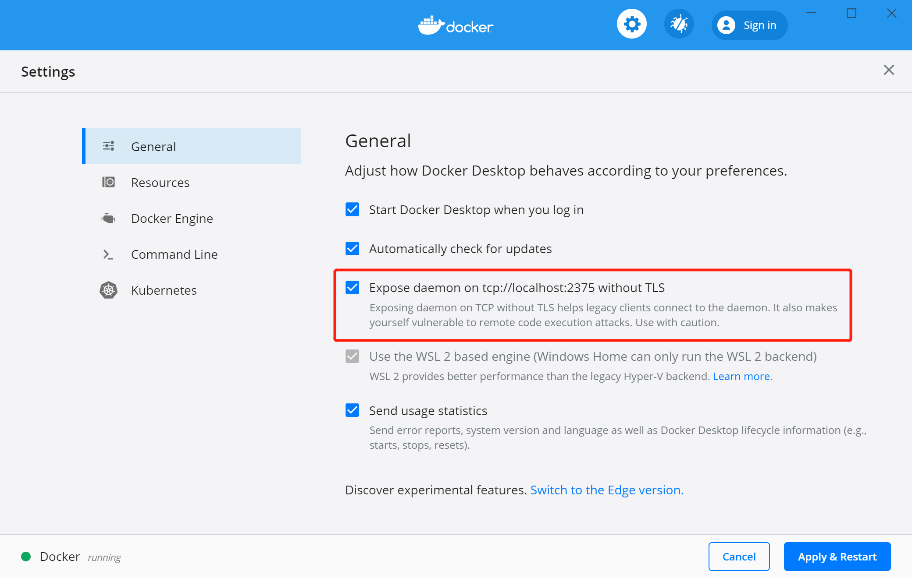
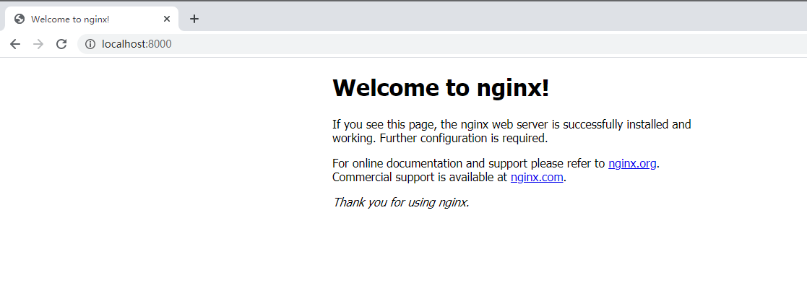
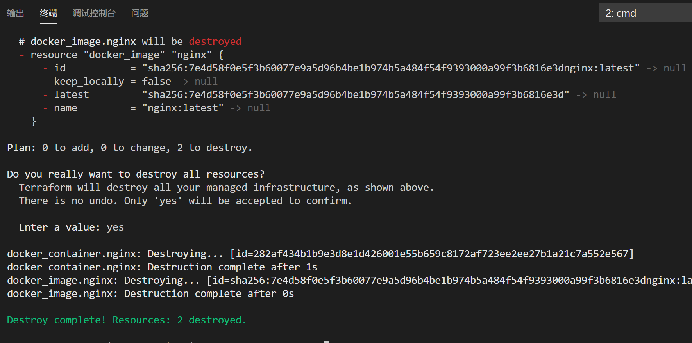

# Terraform初体验（二） 第一个demo执行

## 通过Terraform在本地运行docker nginx

前置条件：
1. 安装好windows docker
2. 安装好terraform

## 安装docker

安装windows docker可以直接登录docker.com下载安装即可，docker可以有图形化管理页面安装最新的19.03。为了简化第一次的操作，这里我们先不通过terraform来安装docker，docker下载安装地址`https://www.docker.com/get-started`


## 编写main.tf

```
terraform {
  required_providers {
    docker = {
      source = "terraform-providers/docker"
    }
  }
}

provider "docker" {
  host    = "tcp://localhost:2375"
}

resource "docker_image" "nginx" {
  name         = "nginx:latest"
  keep_locally = false
}

resource "docker_container" "nginx" {
  image = docker_image.nginx.latest
  name  = "tutorial"
  ports {
    internal = 80
    external = 8000
  }
}
```

其中值得注意的是，官方的例子，在provider "docker"中指定的host是通过windows的管道完成的，怕是已经很多人不会用了。这里需要在docker desktop中设置开启"tcp://localhost:2375"，并替换tf文件中的host ="tcp://localhost:2375"。



## 执行main.tf

笔者使用的vs code，可以直接右键在终端中打开，然后依次进行以下步骤。

### 1. 初始化
在终端中执行`terraform init`。首次执行初始化操作，会有较长的时间去获取terraform中定义的source信息，在第一次初始化后没有source信息的变化，可以跳过初始化直接开始部署。


### 2. 部署
在终端中执行`terraform plan`查看terraform执行计划，在终端中执行`terraform apply`完成部署。执行部署命令时，会将terraform的plan列出来展示给用户，并由用户确定执行。也可以输入`-auto-approve`跳过plan。


输入"yes"


安装完成！


查看结果。



大家可以简单的字面理解main.tf中的语义，会在后面的内容中详细介绍，在此次执行中我们会在本地创建一个nginx的容器，并暴露800端口，我们访问localhost:800可以看到由terraform创建的容器可以正常运行。

### 3. 删除

在终端中执行`terraform destroy`。则删除由tf创建的docker容器。



### 附录

在我们执行`terraform -h`后看到terraform的相关操作命令和使用方法，整理给大家，如果你刚刚开始使用terraform，可以从这些基础命令开始，对于其他命令，请使用前阅读terraform的官方文档。

Usage: terraform [-version] [-help] <command> [args]

Common commands:

    apply              构建或更改基础设施

    console            terraform传参的交互式控制台

    destroy            删除由terraform控制的基础设施

    env                工作空间管理

    fmt                将配置文件重写为规范格式

    get                下载并安装配置模块

    graph              创建terraform资源的可视化图形

    import             将现有基础设施导入terraform

    init               初始化terraform的工作目录

    login              获取并保存远程主机的凭据

    logout             删除远程主机的本地存储凭据

    output             从状态文件读取输出

    plan               生成并显示执行计划

    providers          打印配置中使用的提供程序的树型结构

    refresh            根据实际资源更新本地状态文件

    show               检查terraform的状态或计划

    taint              手动标记污点以便资源重新创建

    untaint            手动取消污点

    validate           验证terraform文件

    version            terraform版本

    workspace          工作空间管理

All other commands:

    0.12upgrade        重写v0.12之前的模块源代码

    0.13upgrade        重写v0.13之前的模块源代码

    debug              debug输出管理

    force-unlock       手动解除terraform锁定状态

    push               推送完成代码到企业仓库
    
    state              关键状态管理