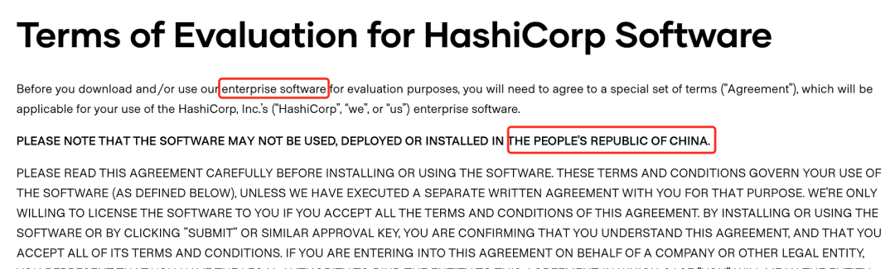

# Terraform初体验（一） windows安装

> Terraform是一款优秀的开源devops工具，中文文档较少，特此整理Terraform相关内容及使用方法。

## Terraform是什么？


在原始的数据中心应用部署中，我们依赖于运维管理员手动去部署我们的基础设施和服务，每一台服务器、每一个数据每一个负载均衡都需要手工配置和管理。这些在我们现在看起来是非常恐怖的，手工带来的错误配置、缓慢的部署方式都让公司的运营陷入黑暗，公司的基础设施和服务开始依赖于人的基数增长。好的消息是计算机领域发展了多年，devops的概念在公司的运营运维中开始崭露头角，现在已经涌现了很多优秀的开源产品，今天要给大家介绍一款功能强大的devops工具：terraform。

Terraform是一款用于安全有效地构建，更改和版本控制基础结构的工具。Terraform可以管理现有数据中心资源和主流云服务提供商资源，以及定制的内部解决方案。

题外话：terraform的母公司HashiCorp在今年5月份停止了包括terraform在内的多款软件企业版的中国使用权，但这不会影响开源产品的使用，在这不想过多介绍其中的起末，只想说开源产品是不属于某一家公司或者国家的，我们国家也有很多优秀的工程师为开源项目贡献，开源既是众人拾柴火焰高，也是世界沟通的桥梁，大家可以在安全可控的范畴使用开源产品。



言归正传，Terraform是Go语言开发的开源项目，[github](https://github.com/hashicorp/terraform)。Terraform主要功能是：

* 基础设施即代码(Infrastructure as Code)：基础设施是使用高级配置语法来描述的。这样就可以像对待任何其他代码一样对数据中心的蓝图进行版本控制和处理。此外，基础架构可以共享和重复使用。

* 执行计划(Execution Plans)：Terraform有一个“计划”步骤，在其中生成执行计划。执行计划将显示Terraform在您调用apply时将执行的操作。这样可以避免Terraform操纵基础结构时出现任何意外。

* 资源视图(Resource Graph)：Terraform构建所有资源的视图，并并行化所有非依赖资源的创建和修改。因此，Terraform尽可能高效地构建基础架构，并且操作员可以洞悉其基础架构中的依赖性。

* 变更自动化(Change Automation)：复杂的变更集可以以最少的人工干预就可以应用于您的基础架构。使用前面提到的执行计划和资源图，您可以准确地知道Terraform将要更改的内容和顺序，从而避免了许多可能的人为错误。

Terraform可以管理现有数据中心资源和主流云服务提供商资源。具体来说就是可以用代码来管理维护IT资源，把之前需要手动操作的一部分任务通过程序来自动化的完成，这样的做的结果非常明显：高效、不容易出错。它提供了对资源和提供者的灵活抽象。该模型允许表示从物理主机、虚拟机、容器、EMail和DNS等所有内容。由于这种灵活性，它可以用来解决许多不同的问题。

这意味着有许多现有的工具与Terraform的功能重叠。但是需要注意的是，Terraform与其他系统并不相互排斥。它可以用于管理小到单个应用程序或大到整个数据中心的不同对象。

Terraform使用配置文件描述管理的组件(小到单个应用程序，大到整个数据中心)。Terraform会生成一个执行计划，描述它将做什么来达到所需的状态，然后执行它来构建所描述的基础结构。随着配置的变化，Terraform 能够确定发生了什么变化，并创建可应用的增量执行计划。

讲了很多概念以后，大家对Terraform有了一个逻辑上的理解，接下来我们开始安装Terraform。

## Windows10 安装 Terraform

Terraform在MAC上安装还是相对简单的，由于缺少中文文档相关介绍内容，在Windows上安装也有踩了一些坑。推荐使用chocolatey进行安装。

### 安装Chocolatey

Chocolatey是一款基于Windows的包管理器，安装后可以轻松的像linux的yum、apt-get包管理器一样来管理你的windows中的应用。使用它来安装terraform的好处就是在后期删除升级都由它来管理，这是非常方便和快速的安装方法。

1. 以管理员身份打开PowerShell，输入`Get-ExecutionPolicy`，返回`Bypass`则代表目前执行的是绕过策略来安装。如果返回的是`Restricted`受限制的，则需要运行`Set-ExecutionPolicy AllSigned` 或者 `Set-ExecutionPolicy Bypass -Scope Process`。

2. 复制下面这条命令即可安装完成，这里没有太多坑。

```
Set-ExecutionPolicy Bypass -Scope Process -Force; [System.Net.ServicePointManager]::SecurityProtocol = [System.Net.ServicePointManager]::SecurityProtocol -bor 3072; iex ((New-Object System.Net.WebClient).DownloadString('https://chocolatey.org/install.ps1'))
```

### 通过Chocolatey安装Terraform

执行命令`choco install terraform`即可完成安装，中间需要注意：

1. 如果网络不够好，可能存在安装失败，可以至此链接下载`https://releases.hashicorp.com/terraform/0.13.3/terraform_0.13.3_windows_amd64.zip`后放至`C:\Users\$user\AppData\Local\Temp\chocolatey\terraform\0.13.3\terraform_0.13.3_windows_amd64.zip`目录，其中`$user`为你的当前用户。
2. 操作后再次执行命令`choco install terraform`即可完成安装。

安装完成后执行`terraform -v`可查看当前安装版本，并检查安装成功。很遗憾的是，没有找到在windows下的命令自动补全方法。