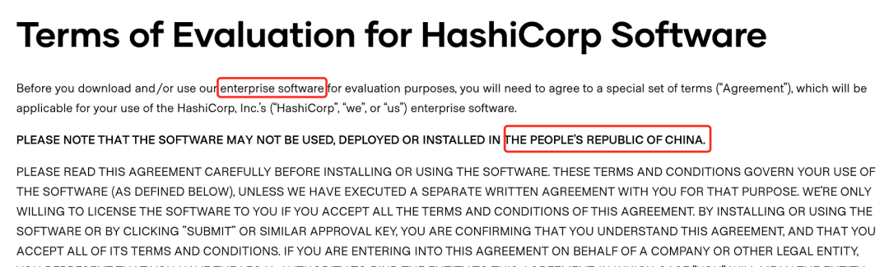
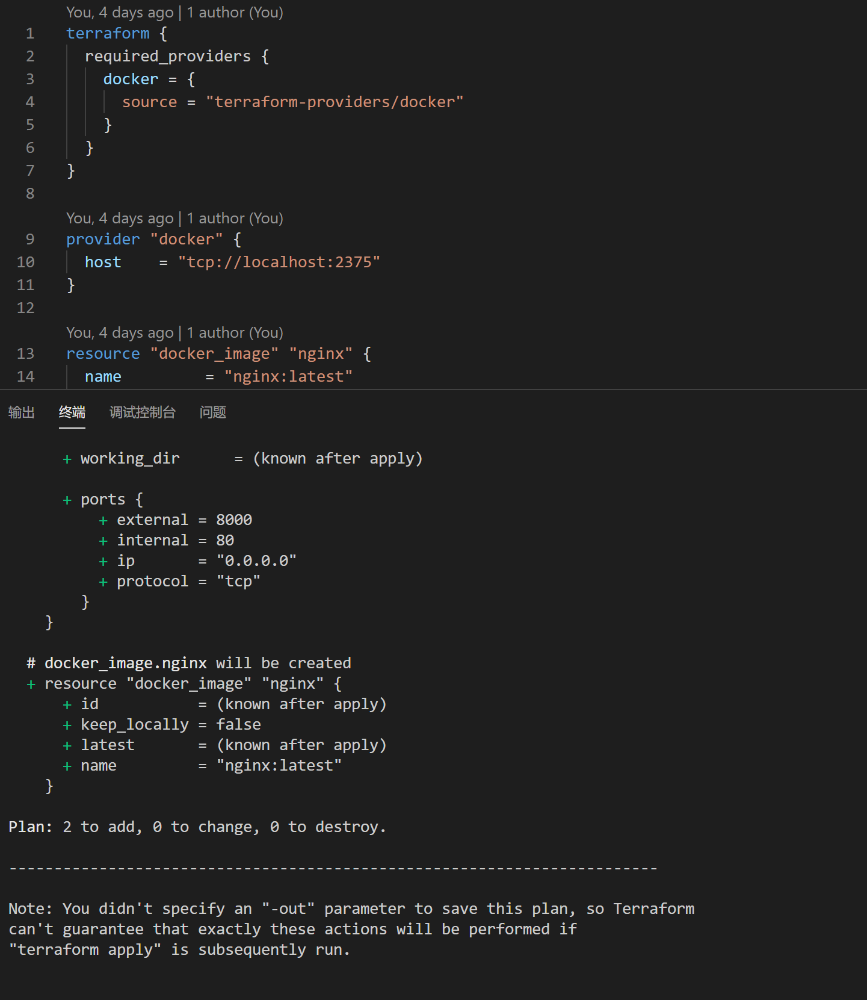
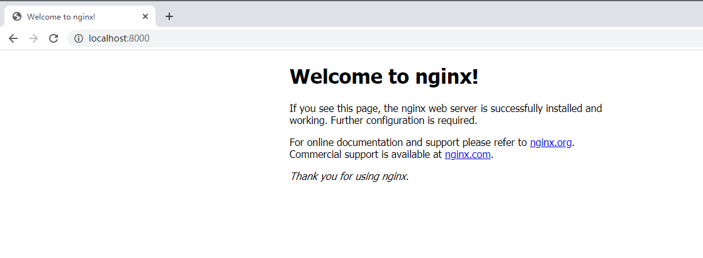

# Terraform初体验（一） windows安装

> Terraform是一款优秀的开源devops工具，中文文档较少，特此整理Terraform相关内容及使用方法。

## Terraform是什么？


在原始的数据中心应用部署中，我们依赖于运维管理员手动去部署我们的基础设施和服务，每一台服务器、每一个数据每一个负载均衡都需要手工配置和管理。这些在我们现在看起来是非常恐怖的，手工带来的错误配置、缓慢的部署方式都让公司的运营陷入黑暗，公司的基础设施和服务开始依赖于人的基数增长。好的消息是计算机领域发展了多年，devops的概念在公司的运营运维中开始崭露头角，现在已经涌现了很多优秀的开源产品，今天要给大家介绍一款功能强大的devops工具：terraform。

Terraform是一款用于安全有效地构建，更改和版本控制基础结构的工具。Terraform可以管理现有数据中心资源和主流云服务提供商资源，以及定制的内部解决方案。

题外话：terraform的母公司HashiCorp在今年5月份停止了包括terraform在内的多款软件企业版的中国使用权，但这不会影响开源产品的使用，在这不想过多介绍其中的起末，只想说开源产品是不属于某一家公司或者国家的，我们国家也有很多优秀的工程师为开源项目贡献，开源既是众人拾柴火焰高，也是世界沟通的桥梁，大家可以在安全可控的范畴使用开源产品。



言归正传，Terraform是Go语言开发的开源项目，[github](https://github.com/hashicorp/terraform)。Terraform主要功能是：

* 基础设施即代码(Infrastructure as Code)：基础设施是使用高级配置语法来描述的。这样就可以像对待任何其他代码一样对数据中心的蓝图进行版本控制和处理。此外，基础架构可以共享和重复使用。

* 执行计划(Execution Plans)：Terraform有一个“计划”步骤，在其中生成执行计划。执行计划将显示Terraform在您调用apply时将执行的操作。这样可以避免Terraform操纵基础结构时出现任何意外。

* 资源视图(Resource Graph)：Terraform构建所有资源的视图，并并行化所有非依赖资源的创建和修改。因此，Terraform尽可能高效地构建基础架构，并且操作员可以洞悉其基础架构中的依赖性。

* 变更自动化(Change Automation)：复杂的变更集可以以最少的人工干预就可以应用于您的基础架构。使用前面提到的执行计划和资源图，您可以准确地知道Terraform将要更改的内容和顺序，从而避免了许多可能的人为错误。

Terraform可以管理现有数据中心资源和主流云服务提供商资源。具体来说就是可以用代码来管理维护IT资源，把之前需要手动操作的一部分任务通过程序来自动化的完成，这样的做的结果非常明显：高效、不容易出错。它提供了对资源和提供者的灵活抽象。该模型允许表示从物理主机、虚拟机、容器、EMail和DNS等所有内容。由于这种灵活性，它可以用来解决许多不同的问题。

这意味着有许多现有的工具与Terraform的功能重叠。但是需要注意的是，Terraform与其他系统并不相互排斥。它可以用于管理小到单个应用程序或大到整个数据中心的不同对象。

Terraform使用配置文件描述管理的组件(小到单个应用程序，大到整个数据中心)。Terraform会生成一个执行计划，描述它将做什么来达到所需的状态，然后执行它来构建所描述的基础结构。随着配置的变化，Terraform 能够确定发生了什么变化，并创建可应用的增量执行计划。

讲了很多概念以后，大家对Terraform有了一个逻辑上的理解，接下来我们开始安装Terraform。

## Windows10 安装 Terraform

Terraform在MAC上安装还是相对简单的，由于缺少中文文档相关介绍内容，在Windows上安装也有踩了一些坑。推荐使用chocolatey进行安装。

### 安装Chocolatey

Chocolatey是一款基于Windows的包管理器，安装后可以轻松的像linux的yum、apt-get包管理器一样来管理你的windows中的应用。使用它来安装terraform的好处就是在后期删除升级都由它来管理，这是非常方便和快速的安装方法。

1. 以管理员身份打开PowerShell，输入`Get-ExecutionPolicy`，返回`Bypass`则代表目前执行的是绕过策略来安装。如果返回的是`Restricted`受限制的，则需要运行`Set-ExecutionPolicy AllSigned` 或者 `Set-ExecutionPolicy Bypass -Scope Process`。

2. 复制下面这条命令即可安装完成，这里没有太多坑。

```
Set-ExecutionPolicy Bypass -Scope Process -Force; [System.Net.ServicePointManager]::SecurityProtocol = [System.Net.ServicePointManager]::SecurityProtocol -bor 3072; iex ((New-Object System.Net.WebClient).DownloadString('https://chocolatey.org/install.ps1'))
```

### 通过Chocolatey安装Terraform

执行命令`choco install terraform`即可完成安装，中间需要注意：

1. 如果网络不够好，可能存在安装失败，可以至此链接下载`https://releases.hashicorp.com/terraform/0.13.3/terraform_0.13.3_windows_amd64.zip`后放至`C:\Users\$user\AppData\Local\Temp\chocolatey\terraform\0.13.3\terraform_0.13.3_windows_amd64.zip`目录，其中`$user`为你的当前用户。
2. 操作后再次执行命令`choco install terraform`即可完成安装。

安装完成后执行`terraform -v`可查看当前安装版本，并检查安装成功。很遗憾的是，没有找到在windows下的命令自动补全方法。

# Terraform初体验（二） 第一个demo执行

## 通过Terraform在本地运行docker nginx

前置条件：
1. 安装好windows docker
2. 安装好terraform

## 安装docker

安装windows docker可以直接登录docker.com下载安装即可，docker可以有图形化管理页面安装最新的19.03。为了简化第一次的操作，这里我们先不通过terraform来安装docker，docker下载安装地址`https://www.docker.com/get-started`


## 编写main.tf

```
terraform {
  required_providers {
    docker = {
      source = "terraform-providers/docker"
    }
  }
}

provider "docker" {
  host    = "tcp://localhost:2375"
}

resource "docker_image" "nginx" {
  name         = "nginx:latest"
  keep_locally = false
}

resource "docker_container" "nginx" {
  image = docker_image.nginx.latest
  name  = "tutorial"
  ports {
    internal = 80
    external = 8000
  }
}
```

其中值得注意的是，官方的例子，在provider "docker"中指定的host是有些错误，无法运行，这里需要在docker desktop中设置开启"tcp://localhost:2375"，并替换tf文件中的host ="tcp://localhost:2375"。


## 执行main.tf

笔者使用的vs code，可以直接右键在终端中打开，然后依次进行以下步骤。

### 1. 初始化
在终端中执行`terraform init`。首次执行初始化操作，会有较长的时间去获取terraform中定义的source信息，在第一次初始化后没有source信息的变化，可以跳过初始化直接开始部署。


### 2. 部署
在终端中执行`terraform plan`查看terraform执行计划，在终端中执行`terraform apply`完成部署。执行部署命令时，会将terraform的plan列出来展示给用户，并由用户确定执行。也可以输入`-auto-approve`跳过plan。



输入"yes"


安装完成！


查看结果。



大家可以简单的字面理解main.tf中的语义，会在后面的内容中详细介绍，在此次执行中我们会在本地创建一个nginx的容器，并暴露800端口，我们访问localhost:800可以看到由terraform创建的容器可以正常运行。

### 3. 删除

在终端中执行`terraform destroy`。则删除由tf创建的docker容器。


### 附录

在我们执行`terraform -h`后看到terraform的相关操作命令和使用方法，整理给大家，如果你刚刚开始使用terraform，可以从这些基础命令开始，对于其他命令，请使用前阅读terraform的官方文档。

Usage: terraform [-version] [-help] <command> [args]

Common commands:
    apply              构建或更改基础设施
    console            terraform传参的交互式控制台
    destroy            删除由terraform控制的基础设施
    env                工作空间管理
    fmt                将配置文件重写为规范格式
    get                下载并安装配置模块
    graph              创建terraform资源的可视化图形
    import             将现有基础设施导入terraform
    init               初始化terraform的工作目录
    login              获取并保存远程主机的凭据
    logout             删除远程主机的本地存储凭据
    output             从状态文件读取输出
    plan               生成并显示执行计划
    providers          打印配置中使用的提供程序的树型结构
    refresh            根据实际资源更新本地状态文件
    show               检查terraform的状态或计划
    taint              手动标记污点以便资源重新创建
    untaint            手动取消污点
    validate           验证terraform文件
    version            terraform版本
    workspace          工作空间管理

All other commands:
    0.12upgrade        重写v0.12之前的模块源代码
    0.13upgrade        重写v0.13之前的模块源代码
    debug              debug输出管理
    force-unlock       手动解除terraform锁定状态
    push               推送完成代码到企业仓库
    state              关键状态管理


https://blog.csdn.net/qq_39611230/article/details/108625840

安装Docker Desktop报错WSL 2 installation is incomplete.

常用命令：

应用生成或更改基础结构

用于地形插值的控制台交互式控制台

摧毁摧毁地形管理的基础设施

环境工作区管理

fmt将配置文件重写为规范格式

获取配置的下载和安装模块

图形创建地形资源的可视化图形

导入将现有基础设施导入Terraform

初始化一个Terraform工作目录

登录获取并保存远程主机的凭据

注销删除远程主机的本地存储凭据

输出从状态文件读取输出

计划生成并显示执行计划

提供程序打印配置中使用的提供程序的树

根据实际资源刷新更新本地状态文件

显示检查地形状态或计划

污点手动标记资源以供娱乐

手动取消打印取消资源标记为受污染

验证验证Terraform文件

版本打印地形版本

工作区工作区管理


所有其他命令：

0.12upgrade重写0.12之前版本的模块源代码

0.13升级重写0.13之前版本的模块源代码

调试调试输出管理（实验）

强制解锁手动解锁地形状态

推送Terraform Enterprise legacy（v1）的过时命令

国家先进的国家管理


# chocolatey

https://chocolatey.org/install

With PowerShell, you must ensure `Get-ExecutionPolicy` is not Restricted. We suggest using `Bypass` to bypass the policy to get things installed or AllSigned for quite a bit more security.

Run `Get-ExecutionPolicy`. If it returns `Restricted`, then run `Set-ExecutionPolicy AllSigned` or `Set-ExecutionPolicy Bypass -Scope Process`.

## setup

Set-ExecutionPolicy Bypass -Scope Process -Force; [System.Net.ServicePointManager]::SecurityProtocol = [System.Net.ServicePointManager]::SecurityProtocol -bor 3072; iex ((New-Object System.Net.WebClient).DownloadString('https://chocolatey.org/install.ps1'))


# terraform

https://learn.hashicorp.com/tutorials/terraform/install-cli

choco install terraform


https://releases.hashicorp.com/terraform/0.13.3/terraform_0.13.3_windows_amd64.zip


C:\Users\20083\AppData\Local\Temp\chocolatey\terraform\0.13.3\terraform_0.13.3_windows_amd64.zip

## test

terraform -help

Usage: terraform [-version] [-help] <command> [args]

The available commands for execution are listed below.The most common, useful commands are shown first, followed by less common or more advanced commands. If you're just getting started with Terraform, stick with the common commands. For the other commands, please read the help and docs before usage.

Common commands:
    apply              Builds or changes infrastructure
    console            Interactive console for Terraform interpolations
    destroy            Destroy Terraform-managed infrastructure
    env                Workspace management
    fmt                Rewrites config files to canonical format
    get                Download and install modules for the configuration
    graph              Create a visual graph of Terraform resources
    import             Import existing infrastructure into Terraform
    init               Initialize a Terraform working directory
    login              Obtain and save credentials for a remote host
    logout             Remove locally-stored credentials for a remote host
    output             Read an output from a state file
    plan               Generate and show an execution plan
    providers          Prints a tree of the providers used in the configuration
    refresh            Update local state file against real resources
    show               Inspect Terraform state or plan
    taint              Manually mark a resource for recreation
    untaint            Manually unmark a resource as tainted
    validate           Validates the Terraform files
    version            Prints the Terraform version
    workspace          Workspace management

All other commands:
    0.12upgrade        Rewrites pre-0.12 module source code for v0.12
    0.13upgrade        Rewrites pre-0.13 module source code for v0.13
    debug              Debug output management (experimental)
    force-unlock       Manually unlock the terraform state
    push               Obsolete command for Terraform Enterprise legacy (v1)
    state              Advanced state management

用法：terraform[-version][-help]<command>[args]


下面列出了可供执行的命令。

最常见、最有用的命令首先显示，然后是

不常见或更高级的命令。如果你只是

从Terraform开始，坚持常用命令。对于

其他命令，请在使用前阅读帮助和文档。


常用命令：

应用生成或更改基础结构

用于地形插值的控制台交互式控制台

摧毁摧毁地形管理的基础设施

环境工作区管理

fmt将配置文件重写为规范格式

获取配置的下载和安装模块

图形创建地形资源的可视化图形

导入将现有基础设施导入Terraform

初始化一个Terraform工作目录

登录获取并保存远程主机的凭据

注销删除远程主机的本地存储凭据

输出从状态文件读取输出

计划生成并显示执行计划

提供程序打印配置中使用的提供程序的树

根据实际资源刷新更新本地状态文件

显示检查地形状态或计划

污点手动标记资源以供娱乐

手动取消打印取消资源标记为受污染

验证验证Terraform文件

版本打印地形版本

工作区工作区管理


所有其他命令：

0.12upgrade重写0.12之前版本的模块源代码

0.13升级重写0.13之前版本的模块源代码

调试调试输出管理（实验）

强制解锁手动解锁地形状态

推送Terraform Enterprise legacy（v1）的过时命令

国家先进的国家管理

## example

```tf
terraform {
  required_providers {
    docker = {
      source = "terraform-providers/docker"
    }
  }
}

provider "docker" {
  host    = "tcp://localhost:2375"
}

resource "docker_image" "nginx" {
  name         = "nginx:latest"
  keep_locally = false
}

resource "docker_container" "nginx" {
  image = docker_image.nginx.latest
  name  = "tutorial"
  ports {
    internal = 80
    external = 8000
  }
}
```

## 初始化
terraform init

## 部署
terraform apply

## 删除
terraform destroy